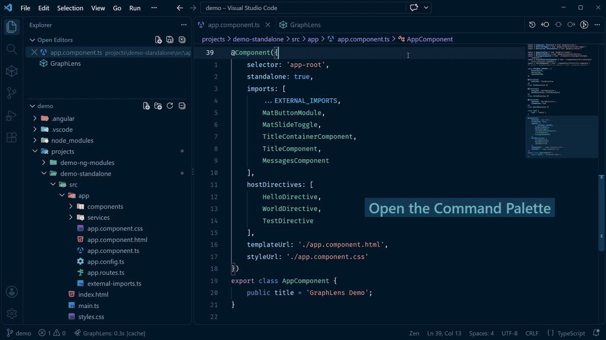

    
    <h1>GraphLens</h1>
    

        
        
        
        
        
        
         
        
        
        
        
        
    

    <h3>Interactive architecture visualizer for Angular projects</h3>
    
Transforms code entropy into structured, navigable graphs

    <a href="https://marketplace.visualstudio.com/items?itemName=graphlens.graphlens" target="_blank">Marketplace</a> •
    <a href="https://graphlens.github.io/graphlens/start-guide.pdf#view=200">Start Guide</a> •
    <a href="https://github.com/GraphLens/graphlens/tree/main/demo">Demo</a> •
    <a href="https://github.com/GraphLens/graphlens/issues">Issues</a> •
    <a href="https://github.com/orgs/GraphLens/discussions">Discussions</a> •
    <a href="https://github.com/GraphLens/graphlens/issues/3">Roadmap</a>

---

### 📢 Updates

> **Release 0.4.0 "Clear Aperture":** Introducing the redesigned Command Palette, Relations list workspace, exploration strategies, extended support for Angular ecosystem, and an enhanced GraphView! Details on the [Releases page](https://github.com/GraphLens/graphlens/releases).

> **Foundation & Identity:** Meet our new brand style and explore the principal concepts driving GraphLens – from software entropy to code liquidity – in the [Core Philosophy](#7-core-philosophy-).

> **Welcome to Polls:** Help shape the upcoming features by voting in our quick [Polls](https://github.com/orgs/GraphLens/discussions/categories/polls).

---

### Table of Contents

- [1. Definition & Purpose](#1-definition--purpose)
- [2. Features](#2-features)
- [3. Requirements](#3-requirements)
- [4. Current Limitations](#4-current-limitations)
- [5. Roadmap](#5-roadmap)
- [6. FAQ](#6-faq)
- [7. Core Philosophy](#7-core-philosophy-)
- [8. Feedback & Contribution](#8-feedback--contribution)
- [9. License](#9-license)

## 1. Definition & Purpose

**GraphLens** is a professional static analysis and architecture visualization tool built for Frontend Developers, Software Architects, Analysts, and QA Specialists working with Angular.

In large-scale Web projects, connections between modules, routes, and components often become invisible and tangled. This increases codebase entropy, leading to "spaghetti code", excessive cognitive load, and reduced development efficiency. It is especially relevant in the era of AI-driven code generation, when it becomes very easy to lose control over the resulting architecture.

GraphLens solves this by performing automated deterministic analysis of your project and visualizing its architecture in the form of structural tree views, relation lists, and interactive graphs. It provides seamless, real-time information and navigation through project entities, helping gain control over the codebase.

It acts as an explorer, interactive navigator, and visualizer for your Angular workspace, helping you to:
-   **Visualize** the high-level structure and architecture
-   **Navigate** efficiently through program entities
-   **Validate** accepted changes and their resulting impact
-   **Onboard** faster into unfamiliar or legacy codebases
-   **Communicate** more effectively with your teammates and stakeholders
-   **Plan** refactoring and development by seeing an accurate picture of your active workspace

#### Disclaimer

GraphLens is currently in **Public Beta**. While engineered for deterministic precision, edge cases in non-standard configurations and complex code patterns may occasionally require fine-tuning. GraphLens supports **Angular v2+** workspaces managed via standard `angular.json` configurations. Please review the [Current Limitations](#4-current-limitations) section before use or report edge cases via [GitHub Issues](https://github.com/GraphLens/graphlens/issues).

## 2. Features

### 2.1. How It Works

GraphLens activates automatically when an `angular.json` configuration file is detected in the VS Code workspace, or when opening TypeScript and HTML template files.

The extension scans your VS Code workspace and explores Angular projects and _program entities_1: Modules, Routes, Components, Directives, and Pipes (metadata & list support). It analyzes Angular metadata properties (imports, declarations, exports, etc.) to resolve relationships between program entities. Based on collected data, it builds interactive directed graphs for three _abstraction levels_2 of architecture: Module Hierarchy, Navigation Map, and Component Tree.

GraphLens weighs just **~0.5 MB**, requires **zero configuration** and is ready out of the box immediately after installation. The analysis is performed **locally** and completes **in seconds to a few minutes**. All processing is performed without AI models – your project data never leaves your machine. The analysis results are **deterministic, reproducible and consistent** given the same input. Under identical conditions, you will always get an accurate "snapshot" of your project's reality.

#### Quick demonstration

### 2.2. Commands

Commands are accessible via the extension Command Palette, as well as through the standard Command Palette under the `GraphLens` category.

**Key Commands:**

| Command | ID | Description |
| :--- | :--- | :--- |
| `GraphLens: Open Command Palette` | `graphlens.openCommandPalette` | Open the main commands menu with context-available actions and entity lists |
| `GraphLens: Find Entity` | `graphlens.findEntity` | Quick-search across workspace indexed entities and navigate directly to their declarations, Structure Tree or GraphView nodes |
| `GraphLens: Explore Relations ` | `graphlens.exploreRelations` | Open the Relations list to inspect incoming and outgoing entity connections grouped by type |
| `GraphLens: Reveal in Tree` | `graphlens.revealEntityInStructureTree` | Locate and focus the active or selected entity inside the sidebar Structure Tree |
| `GraphLens: Open GraphView` | `graphlens.openGraphView` | Open GraphView panel with current project general info and graphs |
| `GraphLens: Refresh Project` | `graphlens.refreshProject` | Re-scan the current project and update the graphs |
| `GraphLens: Restart Exploration` | `graphlens.restart` | Trigger a full re-scan of all projects in the workspace |

A detailed list of commands is available in the **Features -> Commands** tab within the extension description.

### 2.3. Relations list of program entities

A dedicated environment to explore connected Angular entities, accessible via Command palette.

Key features:
-   **Groups:** Categorizes connections by relation type, including imports, parents, children, consumer/template scopes, etc.
-   **Counting:** Displays exact count exceeding 2 for each entity group.
-   **Filter:** Instant search and narrowing of entity lists by name, path, group, connection type, and more.
-   **Quick Actions:** In-place action buttons for exploring secondary relations, navigating, and copying entity metadata.
-   **Customization:** Granular controls over displayed information to tailor the inspection workflow.

### 2.4. Structure Tree Panel in Activity Bar

The GraphLens side panel with cube icon provides a tree view of your Angular workspaces and projects structure:

Key features:
-   **Project Structure:** Quick overview of project structure and program entities.
-   **Context Menu:** Convenient navigation and context actions via right-click.
-   **Entity Locator:** Quick jump to the entity's location on the graphs.

### 2.5. GraphView Panel as portal for achitecture graphs

The main workspace of the extension is an interactive graph environment.

Key features:
-   **Architecture Layout:** Comprehensive visualization of Angular Modules, Components, and Routing levels.
-   **Interactions Highlight:** Select any node to trace its specific relationships.
-   **Context Actions:** Seamless navigation to source code, Structure Tree focusing, and other graph tools.
-   **Theming:** Full support for VS Code High Contrast, Dark and Light themes.

### 2.6. Manual Refresh

The graphs do not update automatically upon file save. To reflect changes in your code:
-   Use the `Refresh` button at the top-left corner of the GraphView or top-right corner of the Structure Tree.
-   Run the `Refresh project` or `Restart exploration` commands via the GraphLens palette. Please note that the latter will clear the cache and trigger re-exploration of the entire workspace.
-   A full re-exploration is highly recommended after updating to version 0.4.0.

## 3. Requirements

To ensure GraphLens works correctly, your environment must meet the following criteria:

### 3.1. VS Code Version

Requires **Visual Studio Code v1.85.0** or newer.

### 3.2. Trusted Workspaces

The extension executes analysis scripts, so it will not function in Restricted Mode. Please ensure your project folder is added to **Trusted Workspaces**.

### 3.3. External Dependencies

**Critical:** For a complete dependency graph analysis, external dependencies must be installed.

Please run `npm install` (or `yarn`, `pnpm`) in your project root before launching GraphLens. If TypeScript cannot resolve imports (files appear red in the editor), the analysis may be incomplete or contain errors.

### 3.4. TypeScript Language Server

GraphLens leverages VS Code's built-in capabilities to find definitions and references.

-   Ensure the built-in **TypeScript and JavaScript Language Features** extension is enabled. GraphLens relies on the data provided by the TS Server to correctly analyze projects.
-   For projects under active development that may contain TS errors, it's recommended to enable `"typescript.tsserver.experimental.enableProjectDiagnostics": true`. This allows the extension to resolve links more accurately during parsing, though it may increase the initial analysis time.

## 4. Current Limitations

-   **Program Entities1:** Supports only Angular Modules, Routes, Components, and Directives. DI services and other Angular building entities are not supported yet, but are planned for future releases.
-   **Manual Refresh:** The graphs do not update automatically upon file save. See the [Manual Refresh](#26-manual-refresh) section for details.
-   **Frameworks:** Supports **Angular v2+** only. React, Vue, Svelte, and Angular meta-frameworks are not supported.
-   **Project Types:** Supports only Angular applications. Angular libraries are not supported yet.
-   **Configurations:** Supports projects with `angular.json` configuration. Legacy configurations with `.angular-cli.json` are not supported.
-   **SSR Support:** Server-side specific configurations and server-side modules are not supported.
-   **Monorepos:** Nx workspaces, specific configurations, and custom monorepo structures are not supported.

## 5. Roadmap

A detailed development roadmap for this year is available here – [Roadmap 2026](https://github.com/GraphLens/graphlens/issues/3).

## 6. FAQ

    
<strong>Does it support Standalone API / Components?</strong>

    

        Yes! GraphLens fully supports the Modern Angular API, including Standalone API / Components. It parses the `imports` array in your component metadata to build the dependency graph.
    

    
<strong>Will it work with React, Vue, or Svelte?</strong>

    

        Currently, GraphLens is designed exclusively for Angular v2+. Focusing on a single framework allows the extension to provide better quality of analysis of working projects.
    

    
<strong>Is there an extension for other code editors?</strong>

    

        Currently, no, but it is planned for mid-term future releases.
    

    
<strong>Why are the graphs empty or showing "Graph is unavailable" on the first launch?</strong>

    

        By default, exploration strategy is set to <code>"Use cache"</code> for maximum activation performance. On the first activation after updating to version 0.4.0, the workspace previously persisted metadata might be in difference with updated algoritms, which can cause graph inaccuracies and fails to rendering. Run the <code>Restart exploration</code> command (<code>graph-lens.restart</code>) from the Command Palette or click <strong>Restart</strong> on the GraphView notification to perform the initial workspace analysis and synchronize inner data structures.
    

## 7. Core Philosophy 🌀

Every software system exists within its own "solution space" – an infinite field of variations and changes. The essence of programming is the continuous evolution of the system and the search for right solutions within this space. In an ideal world, this evolution should unfold harmoniously, much like the Fibonacci sequence spiraling outward, where each new cycle of development naturally builds upon the solid foundation of the previous one, maintaining strict structural and semantic balance.

However, the reality for long-living projects is different. Scaling, shifting requirements, continuous search for solutions, and inevitable trade-offs generate excessive software entropy – a massive, complex, and practically chaotic labyrinth of invisible connections and hidden pitfalls. This is how "shadow architecture" forms. Under these conditions, finding the right solutions demands heavy cognitive load; over-analyzing complex dependencies becomes a daily struggle even for senior developers, and business costs constantly increase. Strict principles, patterns, and technologies like Angular exist to purposefully narrow possible variations and standardize development processes. Yet, under the weight of business demands and scale, systems inevitably grow more complex.

All these aspects are united by the new concept of "Code Liquidity" – a codebase's ability to be accessible, comprehensible, and ready for rapid change in response to new tasks. Just as a highly liquid financial asset can be quickly converted into real value, liquid code can be easily, predictably, and cost-effectively transformed to meet new business requirements. Essentially, all methodologies, principles, patterns, and quality metrics boil down to one primary goal – keeping code in a liquid state. Frameworks serve precisely this purpose – establishing standards and boundaries to increase codebase liquidity. But without the ability to see the complete picture within a reasonable timeframe, overall system liquidity plummets rapidly under the inevitable weight of entropy. This is especially relevant today in the era of AI code generation: when advanced models can produce thousands of lines in seconds, maintaining human control over the generator and resulting architecture becomes a critical condition for project success.

GraphLens is an automated analysis and visualization tool for Angular projects, acting as a point of synergy between the code editor and the framework. Much like a real telescope focuses the light of distant cosmic objects, GraphLens gathers information about your Angular workspace, allowing you to peer into the very center of the architectural cosmos and transform the entropy of complex relationships into a structured and cognitively accessible form. The tool provides a new, faster interface – a visual environment through which take place the reading, perception, and navigation of the project's actual structure and architecture. GraphLens is a tool that gives developers the freedom to easily explore the system and expand their control over its codebase.

By revealing the hidden geometry of connections as interactive graphs, GraphLens helps you comprehend the current state of the system, organize and channel software entropy into the right flow, regain control over the project, and ensure your project maintains the highest level of code liquidity.

## 8. Feedback & Contribution

The project is proprietary, but the project will evolve together with the community.

This is a public repository created for feedback:
-   **Found a bug?** [Create an Issue](https://github.com/GraphLens/graphlens/issues)
-   **Have an idea?** [Start a Discussion](https://github.com/GraphLens/graphlens/discussions)
-   **Stay updated:** [GitHub GraphLens](https://github.com/GraphLens/graphlens)

If you find GraphLens useful, please consider [leaving a review on the Marketplace](https://marketplace.visualstudio.com/items?itemName=graphlens.graphlens&ssr=false#review-details). It helps immensely!

## 9. License

**GraphLens™** is proprietary software. Copyright © 2025–2026 Synergy Spectrum Labs LLC. All Rights Reserved.

This extension is licensed under the **GraphLens End-User License Agreement (EULA)**

-   **You are free to:** Use for personal, educational, and commercial projects free of charge. You own the generated graphs, tree views, and visualizations.
-   **You may not:** Decompile, reverse engineer, extract internal data, modify, resell, or create derivative works based on this software.

See the full [License agreement](./LICENSE.txt) file for details.

The example code located in the `demo` directory is provided under the [MIT License](./demo/LICENSE-MIT.txt).

---

### 📚 Notes & Terminology

1. **Program entities:** Refer to the common building blocks of an Angular application, currently including Angular Modules, Routes, Components, and Directives.
2. **Abstraction or Program levels**: Represent different layers of the application structure formed by these common entities and include Module Hierarchy, Navigation Map, and Component Tree.

---

**Created with respect for human ingenuity ✨🚀**
