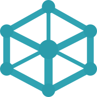

# GraphLens Demo Workspace

This demonstration folder contains an **Angular v20** workspace featuring two simple applications with different architectural approaches: NgModules and Standalone API.

The purpose of these code examples is to demonstrate the capabilities of the **GraphLens** extension and provide a quick overview of its commands and typical initial workflow.

### 🚀 Getting Started

1.  **Install the Extension**

    Install `GraphLens` from the Extensions panel in VS Code and check the [Current limitations](https://github.com/GraphLens/graphlens/tree/main?tab=readme-ov-file#4-current-limitations) section.

2.  **Clone the Repository, Navigate to Demo & Install Dependencies**

    ```bash
    git clone https://github.com/GraphLens/graphlens.git
    cd graphlens/demo
    npm install
    ```

3.  **Open & Trust**

    Open the cloned folder in VS Code. Trust the opened folder by clicking `"Manage"` in the Restricted Mode banner, OR when prompted `"Do you trust the authors...?"` select `"Yes"` to enable the extension<sup>1</sup>.

4.  **Wait for Initialization**

    You will see the GraphLens cube icon appear in the Activity Bar, which looks like 

    -   Let the `TypeScript Language Server` initially scan the repository and provide diagnostics<sup>2</sup>.
    -   GraphLens will automatically start the initial exploration process indicated by the loading animation/badge on the icon.

5.  **Ready to Explore**

    Once the exploration is complete, you can see the status bar message `GraphLens: Explored in <time> s`. This indicates the extension is ready for use.

6.  **Visualize structure**

    Click the GraphLens icon in the Activity Bar. You will see the interactive Tree View of your Angular workspace and containing projects that provide their _program entities_<sup>3</sup> structure.

7.  **Visualize graphs**

    Click the name of one of the applications in the Tree View. This opens the WebView in the editor area featuring a "General info" panel and tabs to explore three _abstraction levels_<sup>4</sup> of the selected application architecture.

8.  **Experiment**

    Now you are ready to use GraphLens!

    Select nodes, use left or right clicks, check extension commands, navigate the graphs and program entities, explore the structure and architecture of projects. Experience is the best teacher!

    Since it's the holiday season, don't forget to apply the **Holiday Atmosphere** in the "General info" panel! 🎄❄️✨

### 📚 Notes & Terminology

1. **Workspace Trust:** GraphLens requires a Trusted Workspace to execute analysis scripts and will not function in Restricted Mode.
2. **TS Server Reliance:** GraphLens relies on the data provided by the TS Server to correctly analyze projects
3. **Program entities:** Refer to the common building blocks of an Angular application, currently including Angular Modules, Routes, Components, and Directives
4. **Abstraction or program levels**: Represent different layers of the application structure formed by these common entities and include Modules Hierarchy, Navigation Map, and Components Tree


### ⚖️ License

The contents of this specific folder `demo` are open source and available under the [MIT License](./LICENSE).
